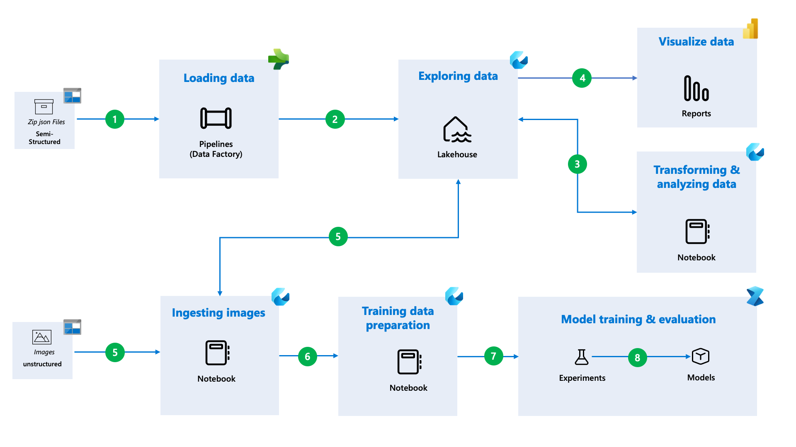

---
lab:
    title: 'Create and use notebooks for data exploration'
    module: 'Explore images for computer vision in Microsoft Fabric'
---

# Load and explore images and their metadata in Microsoft Fabric 

Imagine you're a wildlife researcher who is studying the diversity of wildlife in the African Savannah. You have millions of images captured by camera traps and all the image data stored in `json` metadata files. How do you make sense of all this data? How do you build a data analytics solution that can handle large-scale and complex data sets?

And end-to-end solution that loads the data into Microsoft Fabric, explores the data, prepares the data, and finally trains and evaluates the model may have the following architecture:

1. Load the metadata.
1. Store the metadata in a Lakehouse.
1. Explore the metadata in a notebook.
1. Visualize the metadata in Power BI.
1. Ingest the images in a notebook.
1. Prepare the images for model training.
1. Train and track machine learning models with MLflow.
1. Save a model within the Microsoft Fabric workspace.

In this lab, we'll focus on the first four steps of loading and storing the metadata in a Lakehouse, after which we'll explore and visualize the data by using a SQL endpoint and Power BI.

This lab takes approximately **30** minutes to complete.

> **Note**: You need a Microsoft *school* or *work* account to complete this exercise. If you don't have one, you can [sign up for a trial of Microsoft Office 365 E3 or higher](https://www.microsoft.com/microsoft-365/business/compare-more-office-365-for-business-plans).

## Create a workspace

Before working with data in Fabric, create a workspace with the Fabric trial enabled.

1. Navigate to the Microsoft Fabric home page at `https://app.fabric.microsoft.com` in a browser, and if necessary, sign in with your Fabric credentials.
1. On the Fabric home page, select **Synapse Data Science**.
1. In the menu bar on the left, select **Workspaces** (the icon looks similar to &#128455;).
1. Create a new workspace with a name of your choice, selecting a licensing mode that includes Fabric capacity (*Trial*, *Premium*, or *Fabric*).
1. When your new workspace opens, it should be empty.

### Enable data model editing

When your workspace is created, enable the feature to edit data models in the Power BI service.

1. In your newly created workspace, navigate to **Workspace settings**.
1. Select **Power BI** in the left navigation pane.
1. Select **General**.
1. Check the box for **Users can edit data models in the Power BI service (preview)**.

## Loading data into a Lakehouse

In this section, we'll load the data into a Lakehouse. The data is available in a public blob storage container.

To begin, we will create and configure a new Lakehouse. To do this, in your workspace open the `Data Engineering` workload and Click on Lakehouse provide a the name DemoLakehouse and click Create.

1. In the **Synapse Data Engineering** home page, create a new **Lakehouse** with a name of your choice.
